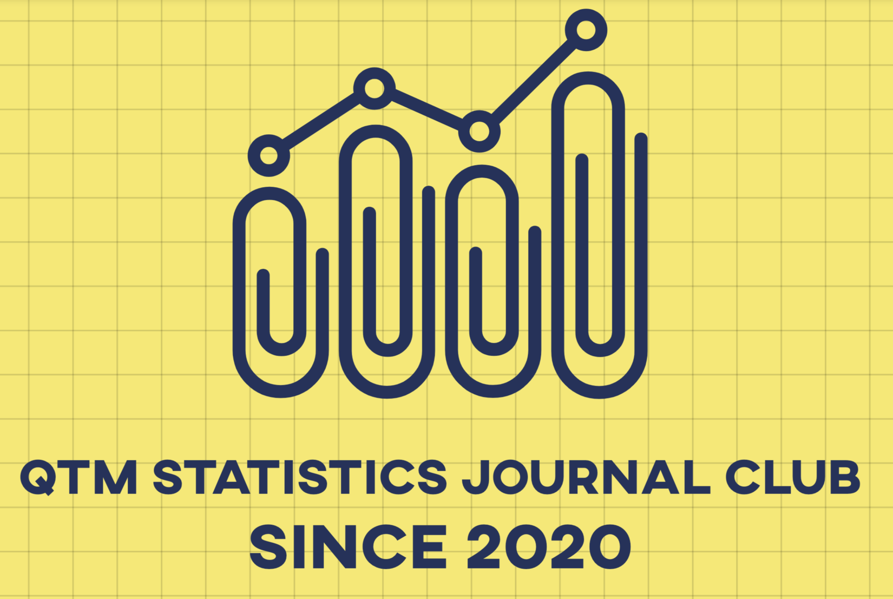

# Welcome to QTM Statistics Journal Club
### Department of Quantitative Theory & Methods, Emory University

We are affiliated to [Department of Quantitative Theory & Methods](http://quantitative.emory.edu/) at Emory University, who trains students in the intersection of liberal arts, statistics, and data science. Here, we discuss the latest methodologies in statistics and data science, along with their novel interdisciplinary applications. Whether you are from Economoics, Psychology, Political Science, Biomedical Sciences, or even _hardcore_ Math/CS theoretical background, y'all are cordially welcomed. Please fill out [This Form](https://forms.gle/ZjpDyLyK2k43BTpt7) to receive seminar materials if desire. We are super glad you are here! 
<\p>

### Upcoming Seminar

- Oct 2: **Parameter Estimation in Infectious Disease Modeling**.   
Speaker: Tony Chen (founder)

### Past Seminar

_Past seminars can be found here_.

- Sept 15: **Introduction to Journal Club & Topics Selection**.   
Speaker: Tony Chen (founder of QTM Journal Club)

### Meeting Venue
In the light of COVID-19 pandemic, we meet online at [Zoom Room for QTM Jounal Club](https://emory.zoom.us/j/97886042991) because we value **quantitative** scientific evidence supporting social distancing.  
Grab a drink and some chips--Get comfy and let's talk stats! 

### Contact

1. [Tony H. Chen](mailto:tony.chen2@emory.edu)  
Founder & Organizer  
Department of Quantitative Theory & Methods, Emory University

2. [Areanna N. Sabine](http://www.quantitative.emory.edu/about/staff/sabine-areanna.html)  
Undergraduate Program Coordinator  
Department of Quantitative Theory & Methods, Emory University

